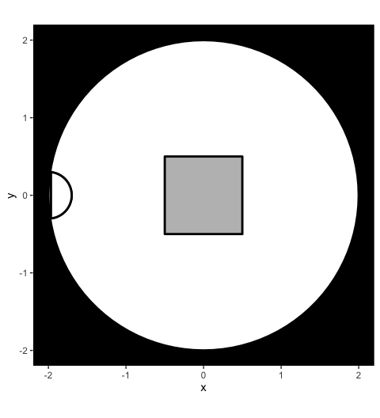
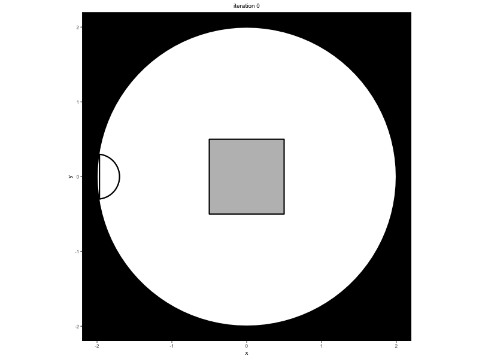

<!-- README.md is generated from README.Rmd. Please edit that file -->
<!-- badges: start -->

[](https://github.com/ndpvh/predped/releases)
[](https://ndpvh.github.io/predped)
[](https://github.com/ndpvh/predped/actions/workflows/R-CMD-check.yaml)
[](https://app.codecov.io/gh/ndpvh/predped)
[](https://www.gnu.org/licenses/gpl-3.0)
<!-- badges: end -->

# predped: An R package around the Minds for Mobile Agents (M4MA) pedestrian model

This project serves as a tool to simulate pedestrian movement using the
Minds for Mobile Agents (M4MA) model. This package enables users to
simulate from the model and estimate the parameters of the model on
movement data, each tailored to their own setting of choice.

## Background

Pedestrian models are popular tools to investigate how people navigate
the complex world that we live in. Yet, most current models assume that
pedestrians are all one and the same, making them solely applicable to
study movement behavior in high-density situations like festivals or
sporting events, but less so in low-density situations like supermarkets
and train stations.

To capture movement behavior in both low- and high-density situations,
Andrew Heathcote and Dora Matzke recently proposed the M4MA, proposing
that pedestrian behavior is determined on three levels:

- *Strategic level*: Consists of what the agent want to achieve and how
  they will navigate the space;
- *Tactical level*: Consists of reacting to the environment and making
  tactical decisions regarding navigation in case of blockages;
- *Operational level*: Consists of the moment-to-moment step decisions
  the agent takes, encompassing changes in direction and/or speed at the
  lowest level.

Critically, M4MAs pedestrians have a particular “personality” reflected
in unique parameters that guide the movement on the operational level.
These individual differences are implemented in two ways:

- *Qualitative differences*: Each pedestrian belongs to a particular
  class of people, defining a particular pedestrian profile that one may
  encounter within the setting of interest;  
- *Quantitative differences*: Within each class, parameter values are
  subject to random variation, assigning each pedestrian with a unique
  combination of parameters.

## Installation

One can install `predped` via the `remotes` package:

``` r
remotes::install_github("ndpvh/predped")
```

To use the package, one should load it through `library`:

``` r
library(predped)
```

## Getting started

To simulate data from the M4MA, `predped` requires the following
workflow.

First, one should define the environment in which the pedestrians will
walk around, defined through the
[`background`](https://ndpvh.github.io/reference/background-class.html)
class. This S4 class defines the `shape` of the environment, , the
`objects` that are contained in it, and a set of `entrance`s and/or
`exit`s. The `shape` and `objects` are furthermore restricted to be
instances of the
[`object`](https://ndpvh.github.io/reference/object-class.html) class,
that is they should be either a
[`rectangle`](https://ndpvh.github.io/reference/rectangle-class.html),
[`polygon`](https://ndpvh.github.io/reference/polygon-class.html), or
[`circle`](https://ndpvh.github.io/reference/circle-class.html).

A simple example of an environment is the following circular room with a
square object placed in the middle:

``` r
setting <- background(
  shape = circle(
    center = c(0, 0), 
    radius = 2
  ), 
  objects = list(
    rectangle(
      center = c(0, 0), 
      size = c(1, 1)
    )
  ),
  entrance = c(-2, 0)
)
```

It is good practice to visualize what the environment looks like. For
this, we can use the
[`plot`](https://ndpvh.github.io/reference/plot.html) function:

``` r
plot(setting)
#> Loading required namespace: ggplot2
```



Once an environment has been defined, on should link this environment
with the characteristics of the agents who are expected to walk around
in this environment. This is achieved through defining an instance of
the [`predped`](https://ndpvh.github.io/reference/predped.html) class,
this time defining the `setting` or environment, the `archetypes` of the
agents expected to walk in it, and the `weights` or probability with
which one expects each archetype to be found within the space.

Agent characteristics are defined through a `data.frame` that contains
parameter values for a given “class” of people. One such dataframe is
provided by us in *archetypes.csv* and can be called in the package
through the variable
[`params_from_csv`](https://ndpvh.github.io/reference/params_from_csv.html)
or through calling the function
[`load_parameters()`](https://ndpvh.github.io/reference/load_parameters.html).
In this example, we wish to use the `"BaselineEuropean"`, specifying the
model as:

``` r
model <- predped(
  id = "my model", 
  setting = setting, 
  archetypes = "BaselineEuropean"
)
```

Once the setting and `predped` model have been defined, one can simulate
pedestrian movement as expected by the M4MA through calling the function
[`simulate`](https://ndpvh.github.io/reference/simulate.html):

``` r
set.seed(1)
trace <- simulate(
  model,
  max_agents = 25, 
  iterations = 50
)
```

The variable `trace` consists of a list of
[`state`](https://ndpvh.github.io/reference/state.html)s of the
environment, each state itself consisting of a copy of the environment
(under slot `setting`) and of a list of pedestrians walking around in
the environment (under slot `agents`). To visualize this trace, one can
again use the [`plot`](https://ndpvh.github.io/reference/plot.html)
function:

``` r
plots <- plot(
  trace,
  print_progress = FALSE
)
```

The [`plot`](https://ndpvh.github.io/reference/plot.html) outputs a list
of plots. For research purposes, it is useful to transform this list to
a gif, which can be achieved by using the `gifski` package:

``` r
gifski::save_gif(
  lapply(plots, print), 
  file.path("readme.gif"),
  delay = 1/10
)
```

    #> [1] "/Users/nielsvanhasbroeck/Documents/UvA/Projects/Software, Pedestrian Modeling/man/figures/readme.gif"

Looking at the created `.gif` then gives us an idea of how the agents
walked around in the room:



## Getting help

You can find the documentation for this package on its dedicated
[documentation site](https://ndpvh.github.io/predped). For an overview
of the logic within the package, we refer the interested reader to the
[Getting
Started](https://ndpvh.github.io/predped/articles/getting_started.html)
page on this site. On this site, we furthermore include information on
the [theoretical
background](https://ndpvh.github.io/predped/articles/theory.html), on
[running
minimal](https://ndpvh.github.io/predped/articles/simulation.html) and
[advanced
simulations](https://ndpvh.github.io/predped/articles/advanced_simulation.html),
and on [estimating the model on
data](https://ndpvh.github.io/predped/articles/estimation.html).

If you encounter a bug, you can report the bug with a minimal working
example as an [Issue](https://github.com/ndpvh/predped/issues).

## Contribute

If you otherwise wish to contribute to this project, feel free to reach
out to Niels Vanhasbroeck (<niels.vanhasbroeck@gmail.com>) and Andrew
Heathcote (<ajheathcote@gmail.com>).

## Credits

The development of this package would not have been possible without the
help of its many contributors. For the development of the `m4ma`
package, we thank (in alphabetical order):

- [Andrew Heathcote](https://github.com/andrewheathcote)
- [Malte Lüken](https://github.com/maltelueken)
- [Charlotte Tanis](https://github.com/CharlotteTanis)

For the creation of the `predped`, we thank its permanent project
members (in alphabetical order):

- [Andrew Heathcote](https://github.com/andrewheathcote)
- [Niels Vanhasbroeck](https://github.com/ndpvh)

as well as those who worked with us temporarily (in alphabetical order):

- [Alexander Anderson](https://github.com/Alexanderson31)
- [Joris Goossen](https://github.com/JorisGoosen)
- [Jakub Jurak](https://github.com/kubojurak)
- [Malte Lüken](https://github.com/maltelueken)
- [Ece Yatıkçı](https://github.com/eceyatikci)

## See also

For more information on the project, please see its dedicated section on
the lab website:
<https://www.ampl-psych.com/projects/minds-for-mobile-agents/>.
